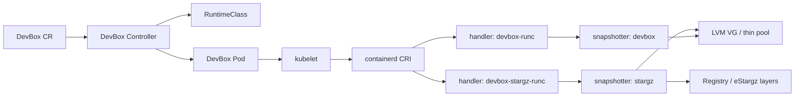
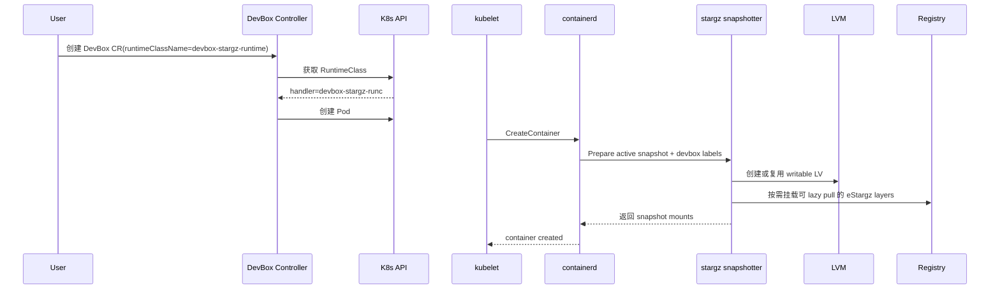

# DevBox Stargz Snapshotter Architecture

本文档用于说明当前 `DevBox + stargz snapshotter` 方案的核心架构。

重点回答四个问题：

- DevBox 在集群里如何区分 `devbox` 和 `stargz` 两条运行路径
- `stargz` 路径下容器根文件系统是如何组装出来的
- LVM writable layer 在整个架构里处于什么位置
- 如何快速验证当前 Pod 是否真的走了 stargz

更详细的部署步骤和配置示例，请参考 [devbox.md](/Users/yy/archary/stargz-snapshotter/docs/devbox.md)。

## 1. 架构目标

当前方案的目标是：

- 在同一个集群中同时支持两种 DevBox 运行模式：
  - `devbox snapshotter`
  - `stargz snapshotter`
- `stargz` 模式下，镜像 lower layer 支持 lazy pull
- Controller 根据真实 `RuntimeClass.handler` 决定运行时路径，避免 runtime metadata 错配

## 2. 总体架构



可以把整个系统理解成两层：

- 控制面：`DevBox Controller` 决定 Pod 的 `runtimeClassName`、记录运行时 metadata
- 数据面：`containerd + snapshotter + registry + LVM` 决定镜像层、可写层和挂载行为

## 3. 运行时分流

### 3.1 RuntimeClass

当前推荐维护两个 RuntimeClass：

```yaml
apiVersion: node.k8s.io/v1
kind: RuntimeClass
metadata:
  name: devbox-runtime
handler: devbox-runc
---
apiVersion: node.k8s.io/v1
kind: RuntimeClass
metadata:
  name: devbox-stargz-runtime
handler: devbox-stargz-runc
```

对应关系如下：

| RuntimeClass | handler | snapshotter |
| --- | --- | --- |
| `devbox-runtime` | `devbox-runc` | `devbox` |
| `devbox-stargz-runtime` | `devbox-stargz-runc` | `stargz` |

### 3.2 Controller 的职责

Controller 不直接把 `runtimeClassName` 当成 runtime handler 使用，而是：

1. 读取 `Devbox.spec.runtimeClassName`
2. 获取对应 `RuntimeClass`
3. 读取 `RuntimeClass.handler`
4. 根据 handler 记录当前 content 对应的 runtime metadata

这样可以保证：

- Pod 的实际运行路径正确
- 后续依赖 runtime metadata 的逻辑不会把 `stargz` 误认成 `devbox`

### 3.3 containerd 路由

containerd 通过 runtime handler 配置完成最终路由：

```toml
[plugins."io.containerd.grpc.v1.cri".containerd]
  snapshotter = "overlayfs"
  disable_snapshot_annotations = false

[plugins."io.containerd.grpc.v1.cri".containerd.runtimes.devbox-runc]
  runtime_type = "io.containerd.runc.v2"
  snapshotter = "devbox"

[plugins."io.containerd.grpc.v1.cri".containerd.runtimes.devbox-stargz-runc]
  runtime_type = "io.containerd.runc.v2"
  snapshotter = "stargz"

[proxy_plugins]
  [proxy_plugins.stargz]
    type = "snapshot"
    address = "/run/containerd-stargz-grpc/containerd-stargz-grpc.sock"
  [proxy_plugins.stargz.exports]
    root = "/var/lib/containerd-stargz-grpc/"
```

其中两个关键点是：

- `disable_snapshot_annotations = false`
- `stargz` 通过 `proxy_plugins` 接入 `containerd-stargz-grpc`

## 4. stargz 路径下的文件系统结构

当 DevBox 使用 `devbox-stargz-runtime` 时，容器根文件系统是一个混合结构：

- lower layer 尽量使用 stargz remote snapshot
- active writable layer 使用 LVM 逻辑卷

可以概括成：

```text
container rootfs
= overlay(lowerdirs..., upperdir=<LVM fs>, workdir=<LVM work>)
```

其中：

- lowerdirs 中一部分可能是 stargz FUSE 挂载的远端 layer
- 另一部分可能是本地普通 layer
- upperdir/workdir 落在 LVM 卷上

## 5. 为什么 stargz 路径里仍可能出现 overlayfs layer

`Snapshotter: stargz` 只说明当前容器走的是 `stargz snapshotter` 插件。

它不表示所有 layer 都一定成功变成 remote lazy layer。

如果某个 layer 缺少：

- `containerd.io/snapshot/stargz/toc.digest`

那么 stargz snapshotter 无法把它当成可验证的 remote layer 挂载，这一层就会回退成普通 overlayfs/local layer。

所以实际运行中常见的是：

- 部分 layer 走 stargz remote snapshot
- 部分 layer 回退成普通 overlayfs/local snapshot

这是当前架构下的正常行为。

## 6. LVM writable layer

### 6.1 触发条件

当 active snapshot 的 `Prepare` 同时带上以下两个 label 时，stargz snapshotter 会进入 devbox writable layer 路径：

- `containerd.io/snapshot/devbox-content-id`
- `containerd.io/snapshot/devbox-storage-limit`

此时 snapshotter 会：

- 为 `content-id` 选择或创建逻辑卷
- 根据 `storage-limit` 创建或扩容 LV
- 在 snapshot 目录下挂载该 LV
- 建立 `snapshot <-> content-id <-> lv` 的元数据关系

### 6.2 LV 命名

`content-id` 不是直接拿来当 LV 名称，而是会生成稳定的 LVM 名：

```text
stargz-devbox-<content-id-safe-prefix>-<sha256前8位>
```

例如：

```text
content-id: 090a86d6-6585-4e7a-b4d4-2c274c060d01
lv name:    stargz-devbox-090a86d6-6585-4e7a-b4d4-9e383ebb
```

这样做是为了：

- 兼容 LVM 命名限制
- 控制名称长度
- 避免截断后重名

## 7. 创建链路

DevBox 使用 `devbox-stargz-runtime` 时，典型创建流如下：



## 8. 关键路径与目录

### 8.1 containerd

| 路径 | 作用 |
| --- | --- |
| `/etc/containerd/config.toml` | containerd 主配置 |
| `/run/containerd/containerd.sock` | containerd socket |
| `/var/lib/containerd` | containerd root |

### 8.2 stargz

| 路径 | 作用 |
| --- | --- |
| `/etc/containerd-stargz-grpc/config.toml` | stargz snapshotter 配置 |
| `/run/containerd-stargz-grpc/containerd-stargz-grpc.sock` | stargz snapshotter socket |
| `/run/containerd-stargz-grpc/cri.sock` | 开启 `cri_keychain` 时的 image service endpoint |
| `/var/lib/containerd-stargz-grpc` | stargz snapshotter root |
| `/var/lib/containerd-stargz-grpc/snapshotter/snapshots/<id>/fs` | 单层 snapshot mountpoint |

### 8.3 LVM

| 项目 | 说明 |
| --- | --- |
| VG | 例如 `devbox-vg` |
| thin pool | 例如 `devbox-vg-thinpool` |
| LV prefix | `stargz-devbox-` |

## 9. 快速验证方法

### 9.1 验证 Pod 是否走 stargz

```bash
ctr -n k8s.io containers info <container-id>
```

重点看：

```json
"Snapshotter": "stargz"
```

### 9.2 验证某个 snapshot 是否真的是 FUSE 挂载

```bash
findmnt -T /var/lib/containerd-stargz-grpc/snapshotter/snapshots/<id>/fs -o TARGET,SOURCE,FSTYPE,OPTIONS
```

常见结果：

- `FSTYPE=fuse.rawBridge`

这说明该 snapshot 是 stargz/go-fuse 挂载出来的。

### 9.3 验证 layer 拉取状态

如果该 snapshot 是 stargz 挂载，在挂载根中通常可以看到：

```bash
ls /.stargz-snapshotter
cat /.stargz-snapshotter/*.json
```

重点字段：

- `digest`
- `size`
- `fetchedSize`
- `fetchedPercent`

## 10. 一句话总结

当前 DevBox stargz 架构本质上是：

> 通过 `RuntimeClass` 把 Pod 路由到 `stargz snapshotter`，使用 stargz 处理可 lazy pull 的 lower layer，同时把 DevBox 的 writable layer 固定落到 LVM 逻辑卷上，形成 “stargz lower + LVM upper” 的混合文件系统结构。
